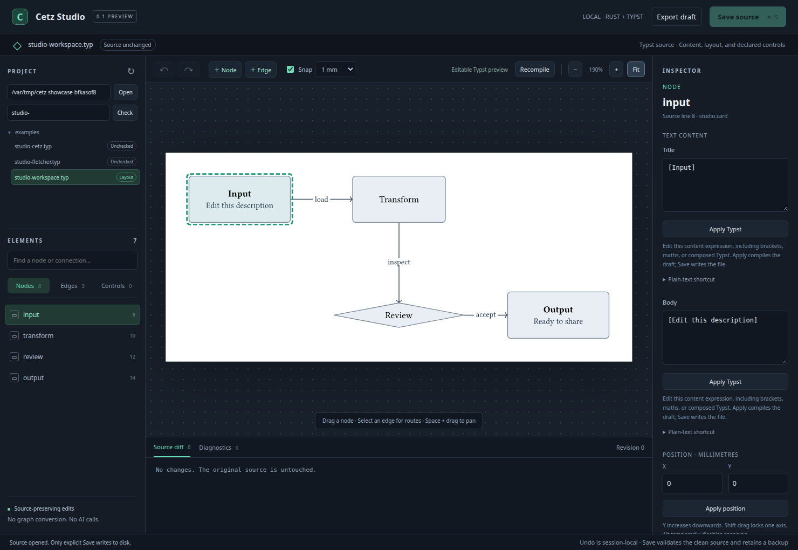
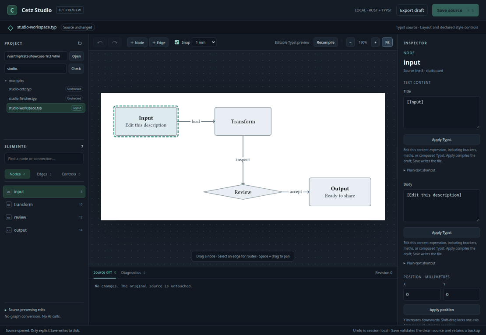

# Cetz Studio

**Develop scientific figures together. Keep the Typst source.**

[](https://github.com/JanDuchscherer104/cetz-studio/actions/workflows/ci.yml)
[](LICENSE)


Cetz Studio is a local visual workspace for researchers who co-develop
scientific figures with coding agents. Discuss the idea in your agent client,
inspect the actual Typst render in Studio, refine the figure on canvas or in
code, and keep a reviewable source.

**Available today:** native Typst previews, supported source-preserving edits,
declared controls, source diffs, undo/redo, and explicit saving with backups.

**Collaboration boundary:** Studio owns previews, supported visual edits and
explicit source changes. Conversation, voice input and agent orchestration stay
in an external coding-agent client such as Codex. Version 0.1 does not provide
an embedded agent session, built-in voice assistant or arbitrary 3D object
editing.



Cetz Studio combines a local Rust/browser editor with a reusable Typst package
for CeTZ and Fletcher drawings. This independent project is unaffiliated with
the CeTZ, Fletcher, and Typst maintainers.

**Version 0.1 is a development preview.** Typst remains the renderer and source
of truth. Supported literal graph coordinates have drag handles; explicit
`studio.param` declarations expose layout and style controls. Other graphics
open as previews with explanations of editing limitations.

| In the canvas | In your source |
| --- | --- |
| Drag nodes and edit selected content | Focused changes to coordinates and Typst expressions |
| Duplicate nodes or insert a primitive | Named Fletcher/Studio calls or an existing project wrapper |
| Browse a folder and check capabilities | Your existing files, imports, fonts, and assets |
| Preview, undo, and compare | Compilation before adoption; explicit Save with a backup |

<details>
<summary>Watch: edit content, explore primitives, move a node, and undo</summary>



Captured from the running Rust server and Typst compiler on the included
workspace example. This is an editable demonstration, not a scientific result.

</details>

## Run locally

Install stable [Rust](https://rustup.rs/) and
[Typst 0.14.2](https://github.com/typst/typst/releases/tag/v0.14.2).
Both macOS and Ubuntu use the same commands. No Node/npm build is required.

```sh
git clone https://github.com/JanDuchscherer104/cetz-studio.git
cd cetz-studio
cargo run --locked --release -- --file examples/studio-workspace.typ --root .
```

Open **http://127.0.0.1:3847**. Use that exact address rather than `localhost`.
The first compilation can download pinned Typst packages; if needed, add
`--compile-timeout 120`. `Ctrl+C` stops the process.

## Work with a coding agent today

Use a sequential handoff, not concurrent disk and canvas editing. Agree on the
figure's lesson and which scientific inputs must remain fixed. Save or export
any browser draft and retain a pre-edit source baseline, then stop the editor
before the agent changes source. Review the agent's edits with a version-control
or text diff against that baseline before restarting Studio. Reopen the updated
file to inspect the actual render and refine supported layout or controls.
Studio starts with a clean draft after reopening; its Diff pane does not retain
the agent's earlier changes. An agent changing a file on disk does not update an
already-open in-memory draft; **Render** is not a disk reload.

Keep display-camera changes separate from recorded acquisition poses, data and
metric definitions. Compilation proves that the source renders, not that a
scientific claim is valid. A visual preference is not scientific approval, and
saving a source file is not publication or manuscript inclusion.

The examples above are native demonstrations. The generated `ui-preview.html`
is a synthetic UI fixture, not evidence that a figure compiled or round-tripped.

Contributors start with [AGENTS.md](AGENTS.md), then the relevant
[architecture and compatibility owner](docs/architecture.md). The
[skills/primitives specification](https://github.com/JanDuchscherer104/cetz-studio/issues/15)
and [controlled 3D specification](https://github.com/JanDuchscherer104/cetz-studio/issues/16)
track the related work without changing current capability claims.

## Browse and author

The **Project** sidebar browses Typst files under the selected folder. Enter a
folder path and choose **Open**, expand directories, or filter by filename.
**Check** compiles visible unchecked files one at a time. Badges distinguish
layout editing, declared controls, preview-only sources, unchecked files, and
compiler errors. An import helper need not be a standalone figure; a diagnostic
is not a blanket statement that the file is incompatible with Typst.

Switching away from a dirty draft offers **Save and continue**, **Discard draft**,
or **Cancel**. Only Save writes the source. Refresh discovers added files and
resets compatibility checks; compilation results are observations, not a watch
service for changes to imported files, fonts, or assets.

For a recognized graph with verified geometry:

- Select a node or edge to edit its Typst content expression, including maths
  and composed markup. A plain-text shortcut safely encodes literal text;
  it stays disabled for rich content. Studio cards expose title and body separately.
- **Duplicate**, or **Copy node** followed by **Paste node**, creates an offset
  copy with a fresh name. Its style and content are retained. Copy/paste stays
  within the current diagram and does not copy attached edges.
- **+ Edge** connects two named nodes with an optional label and arrow direction.
- **+ Node** opens a gallery of Fletcher rectangles, ellipses, and diamonds, plus
  Studio nodes and cards. For a recognized custom architecture wrapper such as
  `n(...)` or `card(...)`, **Architecture node** reuses an existing call as a
  style template, clears its body, and assigns a fresh position, title, and name.
- **Delete node** removes a node, with confirmation before removing attached
  connections. **Delete connection** removes one edge. Both support undo.
  Nodes with unresolved references and the final node remain protected.

These commands compile before being adopted and participate in undo/redo.
The gallery inserts into supported Fletcher diagrams and proven direct project
wrappers; arbitrary CeTZ canvas insertion and cross-file node copying are not implemented.

## Shape a connection

Select an edge and choose **Add corner**, then drag the new handle. Interior
corners can be removed individually. For `studio.edge` inside `studio.diagram`,
**Path mode** switches between a polyline and a real quadratic/cubic CeTZ Bézier
curve. Drag its one or two control handles; switching back retains them as
corners. Ordinary Fletcher edges retain manual corner editing, with an
explanation when Bézier mode requires the Studio wrapper.

For obstacle avoidance, **Preview routes** computes routes around measured node
bounds while keeping nodes fixed. Review the dashed proposal, then **Apply** to
compile and adopt one undoable change. Choose selected, checked, or all eligible
edges, up to 32 per proposal. Routing uses the pinned Rust `pathfinding` crate;
it does not avoid other edges or labels. See [routing details](docs/routing.md).

## Other figures

For the original literal-node and routed-edge demo:

```sh
cargo run --locked --release -- --file examples/demo.typ --root .
```

For your figure, keep imports and assets under its actual project root:

```sh
cargo run --locked --release -- \
  --file /absolute/project/docs/figure.typ --root /absolute/project/docs
```

For the ARIA Chapter 04 attention/decoder pipeline from a Cetz Studio checkout:

```sh
cargo run --locked --release -- \
  --file /home/jd/.codex/worktrees/e5bf/ARIA-NBV/docs/figures/thesis/vector/04-method/04-05-finite-candidate-value-model/candidate-query/studies/attention-decoder.typ \
  --root /home/jd/.codex/worktrees/e5bf/ARIA-NBV/docs
```

Hydrate repository assets with `git lfs pull` before opening figures that embed
LFS-managed SVG or raster files. A pointer file is not a renderable image.
Use **Transparent** beside the Grid control to hide only the rendered page
backdrop in Studio; it does not change the Typst source or exported figure.

`--typst /absolute/path/to/typst` selects the compiler; repeated
`--font-path /absolute/path/to/fonts` supplies fonts. Viewing requires a source
compatible with the installed compiler and available fonts/imports/assets.

## Declare a control

```typst
#import "typst/cetz-studio/lib.typ" as studio
#let radius = studio.param(20mm, label: "Radius", min: 5mm, max: 50mm, step: 1mm)
#let tint = studio.param("#d8eadd", label: "Fill", kind: "color")
#let guides = studio.param(true, label: "Show guides")
#rect(width: radius, height: 10mm, fill: rgb(tint))
```

Select **Controls**, choose a declaration, and apply a value. The editor patches
its literal, recompiles, and adopts the draft only if compilation succeeds.
**Save source** writes it; opening and editing do not write the original.

Declarations must be direct top-level `let` bindings through the recognized
`studio` import. Computed declarations, equations, and data stay source-owned.
A loop can use a declared radius; the editor will not invent per-object overrides.

## Capabilities

| Source | Preview | Editing |
| --- | --- | --- |
| Compiling Typst/CeTZ/custom graphics | Native SVG with page selection | Supported declared parameters |
| One recognized direct Fletcher graph or proven project wrapper | Native measured geometry | Literal node positions, content, insertion from an existing wrapper, waypoints, eligible orthogonal segments, ports, label placement |
| Computed coordinates, loops, unknown wrappers/callbacks | Normal compilation fallback | Declared controls; unsupported gestures disabled |
| Multiple pages or diagrams | Page previews | Declared controls; gestures require verified single-page mapping |
| Missing imports/fonts/assets or invalid source | Compiler diagnostics | Repair source/environment, then reopen or recompile |

Graph editing covers a documented subset of Fletcher. Existing units and
unrelated bytes are retained. Viewing requires no migration into our package.
The bounded local preview accepts sources up to 2 MiB and at most 64 pages,
with 32 MiB per SVG page and 128 MiB total output. Limit failures are diagnostic;
the source is left intact.

## Typst package

[`typst/cetz-studio`](typst/cetz-studio/README.md) contains the standalone
package, themes, and drawing primitives. It works without the companion editor.
The package is prepared for submission but **not yet published on Typst Universe**.
Use relative imports or the local installation instructions in its README.

## Source protection

The browser sends typed commands, never replacement files. Save validates clean
source, checks external changes, creates a unique backup, and stages an atomic
replacement. A conflict retains the draft for export. Undo is bounded and
session-local. PDFs, SVGs, shared styles, and evidence are not overwritten.

The final check and rename are not a filesystem compare-and-swap. Pause other
writers while saving; dependency files are not transactionally locked. File
ownership, ACLs, and extended attributes are not guaranteed preserved. This is
a loopback application for trusted sources, not an untrusted-document sandbox.

## Verify

```sh
cargo fmt --check
cargo clippy --locked --all-targets -- -D warnings
cargo test --locked --all-targets
cargo test --locked --all-targets -- --ignored
typst compile --root . examples/studio-cetz.typ /tmp/studio-cetz.pdf
typst compile --root . examples/studio-fletcher.typ /tmp/studio-fletcher.pdf
```

The ignored tests invoke real Typst. Optional browser checks use Python
Playwright and an installed Chrome/Chromium browser:

```sh
python3 -m venv .venv
. .venv/bin/activate
python3 -m pip install playwright==1.63.0
python3 scripts/build_ui_preview.py
python3 tests/browser_smoke.py --chromium /path/to/chrome
python3 tests/native_browser.py --binary target/debug/cetz-studio --chromium /path/to/chrome
```

Build the debug binary with `cargo build --locked` first. Alternatively install
managed Chromium with `python3 -m playwright install chromium` and omit
`--chromium` from the native browser command. CI runs this native suite on both
Ubuntu and macOS.

See [verification](VERIFICATION.md) for executed evidence and limits, and
[architecture](docs/architecture.md) for compatibility, properties, performance,
and reusable editor foundations.

## License

New project code is MIT. Dependencies and the attributed ARIA source fixture
retain their own terms; see [third-party notices](THIRD_PARTY_NOTICES.md).
